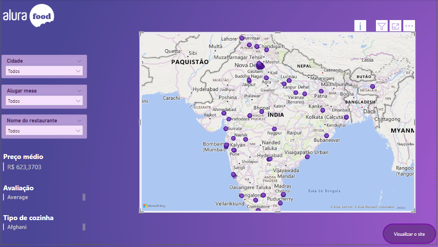
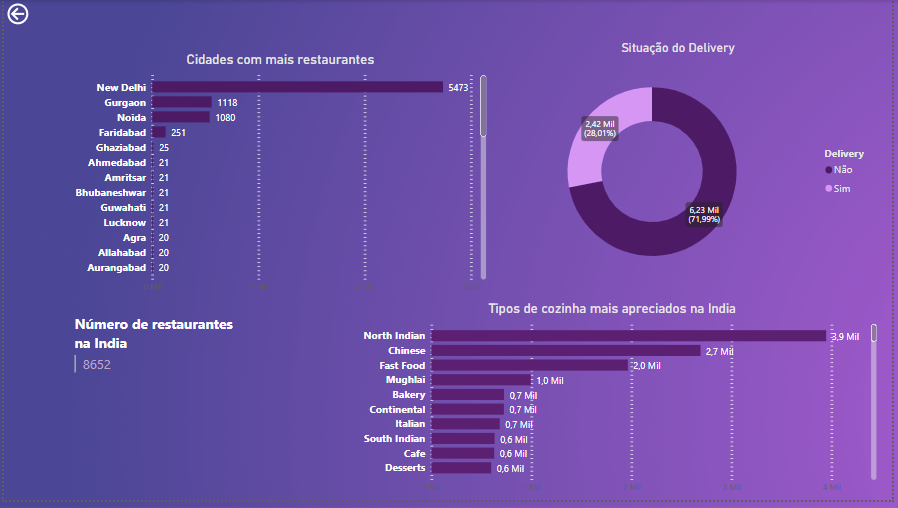
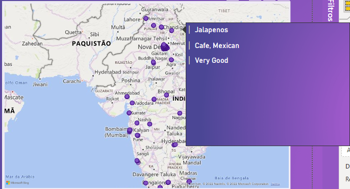

# challenge-bi-2-alurafood
**
 Challenge BI 2 Semana 2 da Alura 
**     
O projeto em questão foi um challenge proposto pela Alura com o seguinte case:  
A Alura Food tem interesse em expandir seu negócio entrando no mercado indiano. 
Para isso, ela precisa da sua ajuda na criação de métricas e análise dos dados disponibilizados para tomar a melhor decisão.  
O dashboard foi feito em PowerBi, e o resultado são as imagens a seguir:  

  
  

  
  

  

